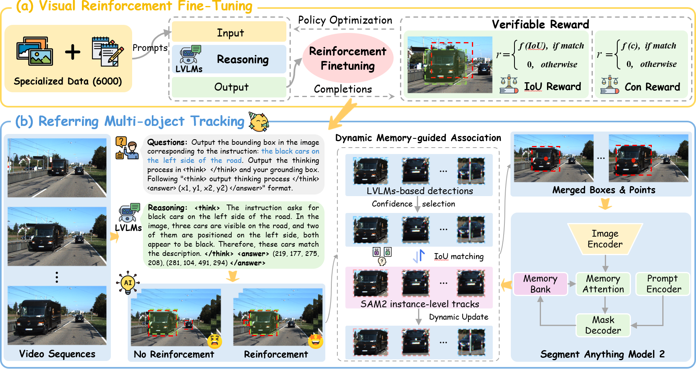

# 🚀 VRFTrack: Visual Reinforcement Fine-Tuning of Large Vision-Language Models for Referring Multi-Object Tracking

**VRFTrack** is a novel Referring Multi-Object Tracking (RMOT) framework that integrates visually reinforced Large Vision-Language Models (LVLMs) with Segment Anything Model 2 (SAM2) for robust language-conditioned tracking. It exploits the reasoning capability of LVLMs for referring localization and uses SAM2-based temporal propagation with Dynamic Memory-guided Association (DMA) to maintain temporally consistent object identities.

<p align="center">
  
</p>

## 🔧 Features

* **Visual Reinforcement Fine-Tuning (VRFT):** Enhances LVLM-based referring localization through Group Relative Policy Optimization (GRPO) with verifiable rewards.
* **Positive-Negative Sample Design:** Improves target-presence reasoning by jointly optimizing referred-object localization and no-object rejection.
* **Dynamic Memory-guided Association (DMA):** Maintains object-level memories for referred tracklets and integrates LVLM detections with SAM2-assisted historical states.
* **SAM2-based Temporal Propagation:** Converts sparse LVLM detections into temporally continuous mask-level object states.
* **Open-world Referring Tracking:** Supports natural language-conditioned tracking across diverse domains and linguistic expressions.

## 🛠️ Setup

Clone the repository:

```bash
git clone https://github.com/acyddl/VRFTrack.git
cd VRFTrack
```

Create the environment:

```bash
conda create -n VRFTrack python=3.10 -y
conda activate VRFTrack
```

Install dependencies:

```bash
pip install -r requirements.txt
```

Install SAM2 following the official instructions:

```bash
git clone https://github.com/facebookresearch/sam2.git
cd sam2
pip install -e .
cd ..
```

For Qwen3-VL and reinforcement fine-tuning dependencies, please refer to the installation instructions in:

```bash
docs/install.md
```

## 📦 Model Preparation

Please prepare the following models before training or inference:

* **Qwen3-VL-4B** as the backbone LVLM.
* **SAM2.1 Hiera Large** for mask-level temporal propagation.
* Fine-tuned VRFTrack checkpoint, if available.

The expected model directory structure is:

```bash
checkpoints/
├── qwen3-vl-4b/
├── sam2.1_hiera_large.pt
└── vrftrack_qwen3vl_grpo/
```

## 📅 Dataset

VRFTrack is evaluated on multiple RMOT benchmarks:

* Refer-KITTI
* Refer-KITTI-V2
* Refer-KITTI+
* Refer-Dance
* Refer-BDD

The Reason-Track dataset is constructed by reformulating RMOT annotations into frame-level image-language grounding samples with positive and negative supervision.

A recommended dataset structure is:

```bash
datasets/
├── Refer-KITTI/
├── Refer-KITTI-V2/
├── Refer-KITTI-plus/
├── Refer-Dance/
├── Refer-BDD/
└── Reason-Track/
```

For dataset preparation, please refer to:

```bash
docs/dataset.md
```

## 🏋️ Visual Reinforcement Fine-Tuning

Before tracking, VRFTrack fine-tunes the LVLM using GRPO with verifiable rewards for localization accuracy, confidence reliability, and response format correctness.

To fine-tune Qwen3-VL on Reason-Track, run:

```bash
sh configs/vrftrack_grpo_train.sh
```

The training process uses positive samples for referred-object localization and negative samples for target-absent reasoning. The model is optimized to output structured responses with normalized bounding boxes and confidence scores.

## 🔍 Inference

For evaluating VRFTrack on Refer-KITTI, run:

```bash
sh configs/vrftrack_test_refer_kitti.sh
```

For evaluating VRFTrack on Refer-KITTI-V2, run:

```bash
sh configs/vrftrack_test_refer_kitti_v2.sh
```

For evaluating VRFTrack on Refer-KITTI+, run:

```bash
sh configs/vrftrack_test_refer_kitti_plus.sh
```

For evaluating VRFTrack on Refer-Dance, run:

```bash
sh configs/vrftrack_test_refer_dance.sh
```

For evaluating VRFTrack on Refer-BDD, run:

```bash
sh configs/vrftrack_test_refer_bdd.sh
```

During inference, the fine-tuned LVLM provides sparse language-conditioned detections, SAM2 propagates object masks across frames, and DMA associates current detections with historical tracklets to preserve object identities.

## 📊 Evaluation

After inference, evaluate the tracking results using TrackEval:

```bash
cd TrackEval/scripts
sh evaluate_rmot.sh
```

The main metrics include:

* **HOTA:** Overall tracking performance.
* **DetA:** Detection accuracy.
* **AssA:** Association accuracy.
* **LocA:** Localization accuracy.
* **DetRe / DetPr:** Detection recall and precision.
* **AssRe / AssPr:** Association recall and precision.

## 🏆 Main Results

### Refer-KITTI

|   Method  | Backbone |    HOTA   |    DetA   |    AssA   |   DetRe   |   DetPr   |   AssRe   |   AssPr   |    LocA   |
| :-------: | :------: | :-------: | :-------: | :-------: | :-------: | :-------: | :-------: | :-------: | :-------: |
| VRFTrack† | Qwen3-VL |   41.27   |   28.09   |   60.71   |   48.79   |   39.28   |   67.52   |   85.98   |   90.78   |
| VRFTrack⋆ | Qwen3-VL | **52.92** | **42.08** | **67.03** | **59.83** | **65.38** | **68.58** | **88.56** | **91.96** |

### Refer-KITTI-V2

|   Method  | Backbone |    HOTA   |    DetA   |    AssA   |   DetRe   |   DetPr   |   AssRe   |   AssPr   |    LocA   |
| :-------: | :------: | :-------: | :-------: | :-------: | :-------: | :-------: | :-------: | :-------: | :-------: |
| VRFTrack† | Qwen3-VL |   36.17   |   22.46   |   58.54   |   53.97   |   27.19   |   69.68   |   77.19   |   86.63   |
| VRFTrack⋆ | Qwen3-VL | **41.26** | **27.39** | **62.78** | **57.83** | **33.44** | **76.26** | **85.27** | **87.97** |

### Refer-Dance

|   Method  | Backbone |    HOTA   |    DetA   |    AssA   |   DetRe   |   AssRe   |
| :-------: | :------: | :-------: | :-------: | :-------: | :-------: | :-------: |
| VRFTrack† | Qwen3-VL |   55.27   |   46.18   |   66.24   |   71.41   |   55.47   |
| VRFTrack⋆ | Qwen3-VL | **57.65** | **48.91** | **69.46** | **78.89** | **73.75** |

### Refer-BDD

|   Method  | Backbone |    HOTA   |    DetA   |    AssA   |   AssRe   |    LocA   |
| :-------: | :------: | :-------: | :-------: | :-------: | :-------: | :-------: |
| VRFTrack† | Qwen3-VL |   33.50   |   19.64   |   57.73   |   68.50   |   86.71   |
| VRFTrack⋆ | Qwen3-VL | **41.36** | **29.74** | **58.52** | **69.41** | **88.37** |

`†` denotes zero-shot results.
`⋆` denotes results obtained using the LVLM after visual reinforcement fine-tuning.

## 🎬 Visualization

Visualization examples can be generated by running:

```bash
sh configs/visualize_vrftrack.sh
```

The visualization results show language-conditioned tracking outputs across traffic scenes, human-centric videos, and open-world scenarios.

<p align="center">
  
</p>

## 📜 License


The code is released for academic research purposes only. Please check the licenses of the corresponding datasets, Qwen3-VL, and SAM2 before use.

## 🙏 Acknowledgement

We sincerely thank the following projects for their excellent open-source resources:

* [Qwen-VL](https://github.com/QwenLM/Qwen-VL)
* [SAM2](https://github.com/facebookresearch/sam2)
* [TransRMOT](https://github.com/wudongming97/RMOT)
* [TempRMOT](https://github.com/zyn213/TempRMOT)
* [TrackEval](https://github.com/JonathonLuiten/TrackEval)

## 📫 Contact

If you have any questions, feel free to open an issue or contact us.
